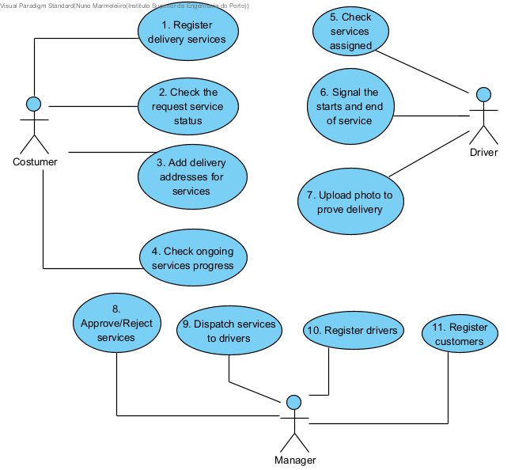

# Use Cases

1. As a Customer, I want to be able to register delivery services so that I can have the parcel delivered to my company/address/place.

2. As a Customer, I want to be able to see the status of my requested service (Pending/Accepted/Rejected/In progress) so that I can have control of my service.

3. As a customer, I want to be able to add delivery addresses for the services I require so that I can receive my cargo on the right place.

4. As a Customer, I want to be able to see the progress of my accepted service so that so that I have full control of my service. (End date)

5. As the Driver, I want to vizualise the services that have been assigned to me so that I can have control of my work.

6. As the Driver, I want to signal the start and end of a service that has been provided by me so that I can finish my task.

7. As a driver, I want to be able to prove my delivery with a photo or a screenshot of the maps so that my job execution is accepted.

8. As a manager, I want to be able to approve or reject a job so that I can control the services.

9. As a manager, I want to be able to dispatch services to drivers so that the services are executed.

10. As a manager, I want to be able to register Drivers in the application so that I have drivers available to execute the services.

11. As a manager, I want to be able to register Customers in the application so that I have the possibility of new services.

## Use Case Diagram

