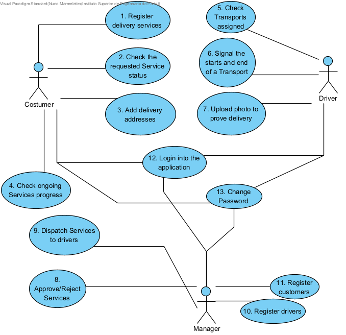

# Use Cases

1. As a Customer, I want to be able to register delivery services so that I can have the parcel delivered to my Location. I should only register delivery services for myself.

2. As a Customer, I want to be able to see the status of my requested Service (Pending/Accepted/Rejected/In progress) so that I can have control of it. I should only check my requested services status.

3. As a customer, I want to be able to add Locations associated to me so that I can choose one of them in the Service. I should only be able to add locations to myself.

4. As a Customer, I want to be able to see the progress of my accepted Service so that I have full control of it. I should only have control of my accepted services.

5. As the Driver, I want to visualize the Transports that have been assigned to me so that I can have control of my work. I should only visualize the transports assigned to me.

6. As the Driver, I want to signal the start and end of a Transport that has been provided by me so that I can finish my Service. I should only signal the start of a transport if it is assigned to me, I should only signal the end of a transport that had been assigned to me and started by me and not yet concluded.

7. As a driver, I want to be able to prove my delivery with a photo or a screenshot of the maps so that my job execution is accepted. I should only verify my execution if the job is assigned to me and started by me.

8. As a manager, I want to be able to approve or reject a job so that I can control the Services. I should only approve and reject jobs if they are registered in the system by clients.

9. As a manager, I want to be able to dispatch services to drivers so that the Services are executed. I should only dispatch services if the requests are approved.

10. As a manager, I want to be able to register Drivers in the application so that the Transports can be executed by them. I should only be able to register them and not update their data.

11. As a manager, I want to be able to register Customers in the application so that I have the possibility of new Services be asked. I should only be able to register them and not update their data.

12. As a user of the system, I want to be able to login into the application so that I can access the application features. I should not be able to access the system without valid login credentials.

## Use Case Diagram

